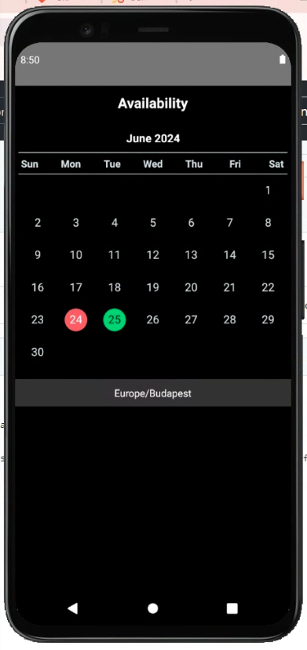
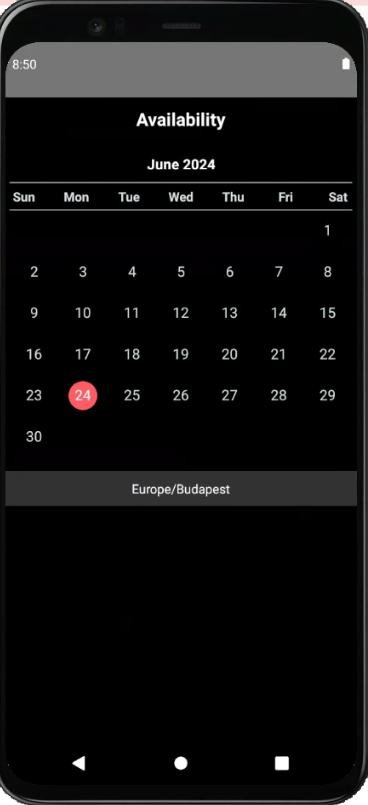
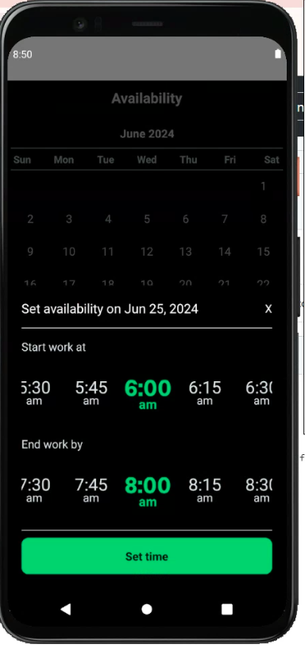
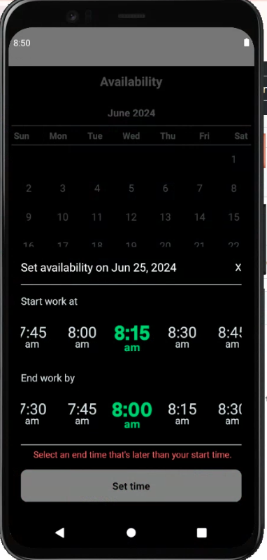

# Calendar App
## Background
The Calendar app is designed to provide users with an intuitive and efficient way to manage their daily schedules by selecting and setting availability times. Key features include scrolling through months, setting availability times, and visual cues for days with set times.

Here's video recording: https://youtube.com/shorts/9iN9PfZpeD8

## Features
The Calendar app offers a user-friendly interface with the following capabilities:
1. **Current Date Highlight: Today's date is highlighted in red.**
2. **Muted Historical Dates: Past dates have muted text colors for distinction.**
3. **Device Timezone Display: Shows the current timezone based on the device's settings.**
4. **Month Navigation: Users can scroll vertically to future months, with each month snapping into place. The scrolling header with weekdays and timezone information remains fixed.**
5. **Date Selection and Bottom Sheet: Tapping a date brings up a bottom sheet to set availability times.**
6. **Time Selection: Default times are 6:00 am to 8:00 pm, adjustable in 15-minute increments.**
7. **Time Validation: Ensures start time is before end time.**
8. **Time Storage: Times are stored in local state and highlighted on the calendar.**
9. **Editing and Saving: Allows editing of previously set times, with changes saved locally.**
## How to Clone the Repository
1. **Clone the repository:**
   git clone https://github.com/deamobiledev/truckup-test.git
2. **Navigate to the project directory:**
   cd truckup-test
### Build and Run
1. **Install dependencies:**
   npm install
2. **Run on Android:**
   npx react-native run-android
### Testing
**Run tests:**
   npm test